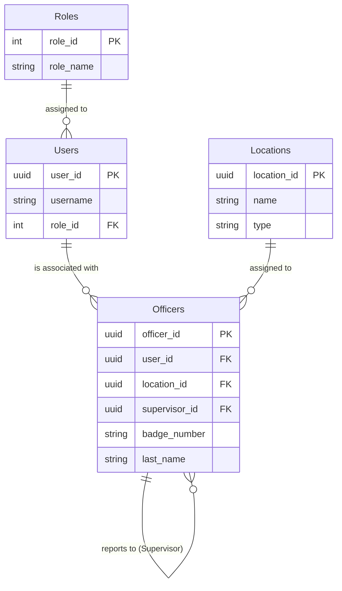
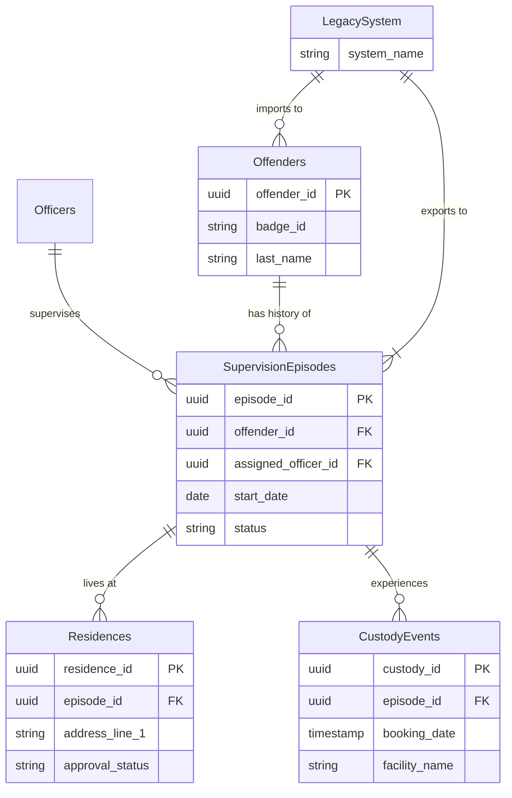
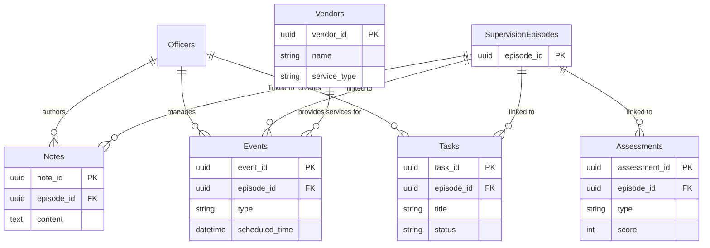

# Database Schema and Data Dictionary

This document outlines the proposed database schema for the Parole Officer Field Dashboard. It is designed to support current functionality (Profiles, Tasks, Notes) and future requirements (RBAC, Vendor Integration, Advanced Reporting).

## Entity Relationship Diagrams (ERD)

To improve readability, the schema is broken down into functional areas.

### 1. Core System & Access Control
Focuses on Users, Roles, Officers, and Locations.

### 2. Supervision & History
Focuses on Offenders, Episodes, Residences, and Custody. Includes Legacy Import/Export.

### 3. Daily Operations
Focuses on Tasks, Notes, Events, and Assessments.

## Data Dictionary

### 1. Roles
Defines user permissions levels within the system.

| Column Name | Data Type | Constraints | Description |
| :--- | :--- | :--- | :--- |
| `role_id` | INT | PK, Auto-increment | Unique identifier for the role. |
| `role_name` | VARCHAR(50) | Not Null, Unique | Name of the role (e.g., 'Officer', 'Supervisor', 'Admin'). |
| `description` | VARCHAR(255) | Nullable | Brief description of the role's permissions. |

### 2. Users
System access credentials. Separated from `Officers` to allow for non-officer users (e.g., IT admins, Clerks).

| Column Name | Data Type | Constraints | Description |
| :--- | :--- | :--- | :--- |
| `user_id` | UUID | PK | Unique identifier for the user. |
| `username` | VARCHAR(50) | Not Null, Unique | Login username. |
| `email` | VARCHAR(100) | Not Null, Unique | User's email address. |
| `password_hash` | VARCHAR(255) | Not Null | Hashed password for security. |
| `role_id` | INT | FK (Roles) | The role assigned to this user. |
| `created_at` | TIMESTAMP | Default NOW() | When the account was created. |
| `last_login` | TIMESTAMP | Nullable | Timestamp of the last successful login. |

### 3. Locations
Physical locations for officers and department resources.

| Column Name | Data Type | Constraints | Description |
| :--- | :--- | :--- | :--- |
| `location_id` | UUID | PK | Unique identifier. |
| `name` | VARCHAR(100) | Not Null | Name of the location (e.g., 'Downtown Field Office'). |
| `address` | VARCHAR(255) | Not Null | Physical address. |
| `type` | VARCHAR(50) | Not Null | Type of facility (HQ, Field Office, etc.). |

### 4. Officers
Details specific to parole officers, including hierarchy and location.

| Column Name | Data Type | Constraints | Description |
| :--- | :--- | :--- | :--- |
| `officer_id` | UUID | PK | Unique identifier for the officer. |
| `user_id` | UUID | FK (Users) | Link to the system user account. |
| `location_id` | UUID | FK (Locations) | The officer's primary work location. |
| `supervisor_id` | UUID | FK (Officers) | The officer's direct supervisor (Self-referencing). |
| `badge_number` | VARCHAR(20) | Not Null, Unique | Official badge number. |
| `first_name` | VARCHAR(50) | Not Null | Officer's first name. |
| `last_name` | VARCHAR(50) | Not Null | Officer's last name. |
| `phone_number` | VARCHAR(20) | Nullable | Work contact number. |

### 5. Offenders
The core entity representing the individuals. Supervision details are now in `SupervisionEpisodes`.

| Column Name | Data Type | Constraints | Description |
| :--- | :--- | :--- | :--- |
| `offender_id` | UUID | PK | Unique system identifier. |
| `badge_id` | VARCHAR(20) | Not Null, Unique | External ID used by the department (e.g., DOC number). |
| `first_name` | VARCHAR(50) | Not Null | Offender's first name. |
| `last_name` | VARCHAR(50) | Not Null | Offender's last name. |
| `dob` | DATE | Not Null | Date of birth. |
| `image_url` | VARCHAR(255) | Nullable | Path or URL to profile photo. |
| `created_at` | TIMESTAMP | Default NOW() | When the record was created. |

### 6. SupervisionEpisodes
Tracks distinct periods of supervision for an offender (e.g., Parole 2020-2022, Probation 2024-Present).

| Column Name | Data Type | Constraints | Description |
| :--- | :--- | :--- | :--- |
| `episode_id` | UUID | PK | Unique identifier for the episode. |
| `offender_id` | UUID | FK (Offenders) | The offender under supervision. |
| `assigned_officer_id` | UUID | FK (Officers) | The officer responsible for this specific episode. |
| `start_date` | DATE | Not Null | When the supervision period began. |
| `end_date` | DATE | Nullable | When the supervision period ended (Null if active). |
| `status` | VARCHAR(20) | Not Null | Current status of this episode (Active, Completed, Revoked, Absconded). |
| `risk_level_at_start` | VARCHAR(20) | Not Null | Initial risk level. |
| `closing_reason` | VARCHAR(100) | Nullable | Reason for closure (Successful Completion, Revocation). |

### 7. Residences (Home Plans)
Tracks history of living arrangements and approval status. Replaces `AZ_DOC_HOME_PLAN`.

| Column Name | Data Type | Constraints | Description |
| :--- | :--- | :--- | :--- |
| `residence_id` | UUID | PK | Unique identifier. |
| `episode_id` | UUID | FK (SupervisionEpisodes) | The episode context. |
| `address_line_1` | VARCHAR(255) | Not Null | Street address. |
| `city` | VARCHAR(100) | Not Null | City. |
| `state` | VARCHAR(50) | Not Null | State. |
| `host_name` | VARCHAR(100) | Nullable | Primary resident (e.g., Mother, Spouse). |
| `relationship_type` | VARCHAR(50) | Nullable | Relationship to offender (Replaces `RELATION_SHIP_ID`). |
| `approval_status` | VARCHAR(50) | Default 'Pending' | 'Pending', 'Approved', 'Denied'. |
| `start_date` | DATE | Nullable | When they moved in. |
| `end_date` | DATE | Nullable | When they moved out. |
| `is_current` | BOOLEAN | Default False | Flag for current location. |

### 8. CustodyEvents (Movement History)
Tracks when an offender enters or leaves jail/prison during supervision. Replaces `az_doc_inmate_traffic_history`.

| Column Name | Data Type | Constraints | Description |
| :--- | :--- | :--- | :--- |
| `custody_id` | UUID | PK | Unique identifier. |
| `episode_id` | UUID | FK (SupervisionEpisodes) | The episode context. |
| `booking_date` | TIMESTAMP | Not Null | When they went in. |
| `release_date` | TIMESTAMP | Nullable | When they got out. |
| `facility_name` | VARCHAR(100) | Not Null | Which jail/prison? |
| `reason` | VARCHAR(100) | Not Null | 'Parole Hold', 'New Charge', 'Sanction'. |

### 9. Tasks (Parole Plan)
Action items linked to a specific supervision episode.

| Column Name | Data Type | Constraints | Description |
| :--- | :--- | :--- | :--- |
| `task_id` | UUID | PK | Unique identifier for the task. |
| `episode_id` | UUID | FK (SupervisionEpisodes) | The episode this task belongs to. |
| `created_by` | UUID | FK (Officers) | The officer who created the task. |
| `title` | VARCHAR(100) | Not Null | Short title of the task. |
| `description` | TEXT | Nullable | Detailed instructions. |
| `due_date` | DATE | Nullable | When the task must be completed. |
| `status` | VARCHAR(20) | Default 'Pending' | Status: 'Pending', 'Completed', 'Not Due'. |
| `created_at` | TIMESTAMP | Default NOW() | When the task was assigned. |
| `updated_at` | TIMESTAMP | Default NOW() | Last modification time. |

### 10. Notes
Chronological case notes linked to an episode.

| Column Name | Data Type | Constraints | Description |
| :--- | :--- | :--- | :--- |
| `note_id` | UUID | PK | Unique identifier for the note. |
| `episode_id` | UUID | FK (SupervisionEpisodes) | The episode context for the note. |
| `author_id` | UUID | FK (Officers) | The officer who wrote the note. |
| `content` | TEXT | Not Null | The body text of the note. |
| `created_at` | TIMESTAMP | Default NOW() | When the note was created. |

### 11. Assessments
Records of risk and needs assessments.

| Column Name | Data Type | Constraints | Description |
| :--- | :--- | :--- | :--- |
| `assessment_id` | UUID | PK | Unique identifier. |
| `episode_id` | UUID | FK (SupervisionEpisodes) | The episode context. |
| `type` | VARCHAR(50) | Not Null | Type of assessment (e.g., 'ORAS-CST'). |
| `score` | INT | Not Null | Numerical score result. |
| `risk_level_result` | VARCHAR(20) | Not Null | Resulting risk level (Low, Medium, High). |
| `details` | JSONB | Nullable | JSON object containing specific category scores. |
| `completed_date` | DATE | Not Null | When the assessment was completed. |
| `completed_by` | UUID | FK (Officers) | Officer who performed/completed the assessment. |

### 12. Events
Calendar items linked to an episode.

| Column Name | Data Type | Constraints | Description |
| :--- | :--- | :--- | :--- |
| `event_id` | UUID | PK | Unique identifier. |
| `episode_id` | UUID | FK (SupervisionEpisodes) | The episode context. |
| `officer_id` | UUID | FK (Officers) | The officer managing the event. |
| `vendor_id` | UUID | FK (Vendors), Nullable | External vendor involved. |
| `type` | VARCHAR(50) | Not Null | Event type (Check-in, UA, Home Visit). |
| `scheduled_time` | TIMESTAMP | Not Null | Date and time of the event. |
| `location` | VARCHAR(100) | Nullable | Where the event takes place. |
| `status` | VARCHAR(20) | Default 'Scheduled' | Status: 'Scheduled', 'Completed', 'Missed', 'Cancelled'. |
| `outcome_notes` | TEXT | Nullable | Results or notes from the event. |

### 13. Vendors
External service providers.

| Column Name | Data Type | Constraints | Description |
| :--- | :--- | :--- | :--- |
| `vendor_id` | UUID | PK | Unique identifier. |
| `name` | VARCHAR(100) | Not Null | Company name. |
| `service_type` | VARCHAR(50) | Not Null | Type of service provided. |
| `contact_email` | VARCHAR(100) | Nullable | Administrative contact. |
| `api_endpoint` | VARCHAR(255) | Nullable | Base URL for API integration. |
| `api_key_ref` | VARCHAR(255) | Nullable | Reference ID for the API key. |

## Legacy Data Migration Strategy

### 1. Initial Data Dump Requirements
The following fields are required from the legacy system to populate the initial state of the new system.

#### Offender Core Data
*   `DOC_NUM` -> `Offenders.badge_id`
*   `FIRST_NAME` -> `Offenders.first_name`
*   `LAST_NAME` -> `Offenders.last_name`
*   `DOB` -> `Offenders.dob`
*   `IMAGE_BLOB` -> `Offenders.image_url` (Requires processing)

#### Current Supervision Status
*   `SUPERVISION_START_DATE` -> `SupervisionEpisodes.start_date`
*   `RISK_LEVEL` -> `SupervisionEpisodes.risk_level_at_start`
*   `ASSIGNED_OFFICER_ID` -> `SupervisionEpisodes.assigned_officer_id` (Requires mapping to new Officer IDs)

#### Current Location
*   `CURRENT_ADDRESS` -> `Residences.address_line_1`, `city`, `state`
*   `HOST_NAME` -> `Residences.host_name`
*   `RELATIONSHIP_ID` -> `Residences.relationship_type` (Requires lookup mapping)

#### Active Conditions
*   `SPECIAL_CONDITIONS` -> `Tasks` (Each condition becomes a pending task)

### 2. Post-Supervision Export
Upon completion of a supervision episode, the system will generate a "Supervision History" document for upload to the legacy system.

#### File Format
*   **Format**: PDF or JSON
*   **Naming Convention**: `[DOC_NUM]_SupervisionHistory_[EPISODE_ID].pdf`

#### Content
*   **Summary**: Start/End dates, Final Status, Closing Officer.
*   **Chronological Log**:
    *   All `Notes` (Date, Author, Content).
    *   All `Events` (Date, Type, Outcome).
    *   All `CustodyEvents` (Booking/Release dates, Facilities).
    *   All `Assessments` (Date, Type, Score).
    *   All `Residences` (Address, Dates).
